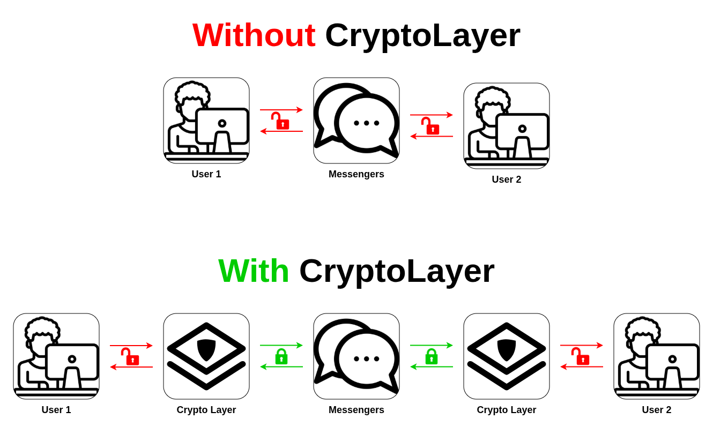

 
<h3>CryptoLayer</h3>
<h6>Криптографический слой, работающий поверх существующих мессенджеров и обеспечивающий end-to-end шифрование сообщений только на стороне пользователя</h6>

 

# Что такое CryptoLayer?

**CryptoLayer** - это библиотека, которая не заменяет мессенджеры, а защищает содержимое ваших сообщений с помощью криптографии. 
 

 
Библиотека реализует собственный сетевой стек и шифрует содержимое сообщений до того, как они попадут в мессенджер.
 

 
Проще говоря: для CryptoLayer любой мессенджер - это просто ненадежный "провод", поэтому всё шифрование и гарантия доставки происходят исключительно в CryptoLayer только на вашем устройстве.

## ☝️ Важно

Пользователь имеет фундаментальное право на **приватное и защищённое общение**. Это включает право **самостоятельно применять криптографические средства** для защиты своих сообщений, а также право на конфиденциальность переписки **без несанкционированного доступа третьих сторон**.

Проект исходит из принципа, что безопасное и частное общение - это **базовая цифровая норма, а не привилегия**.
