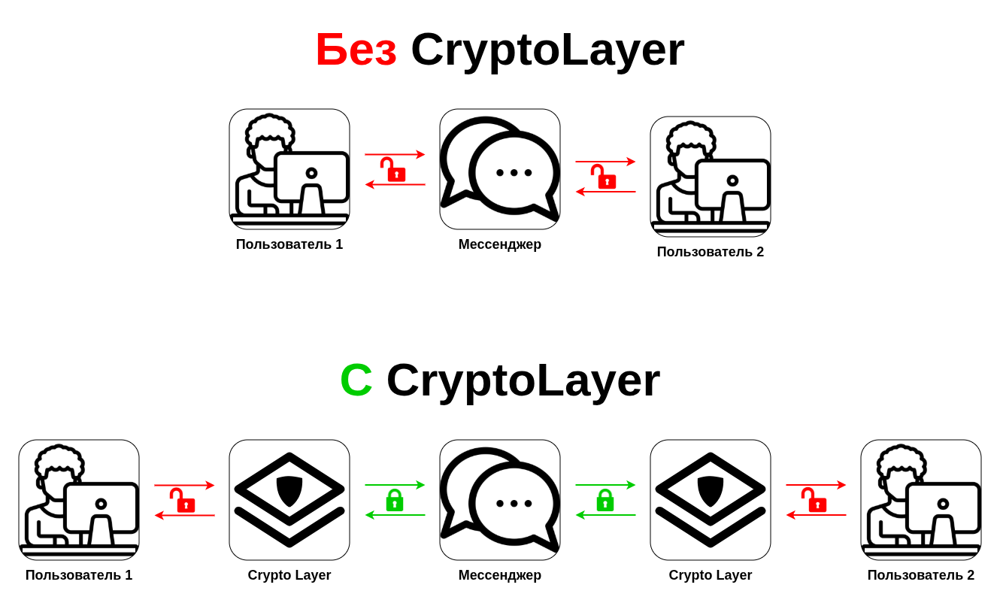
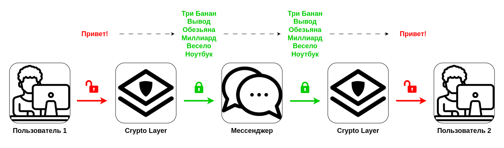
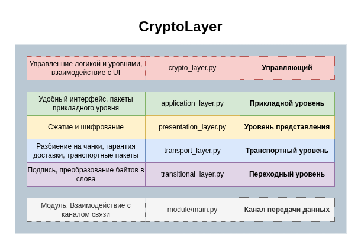
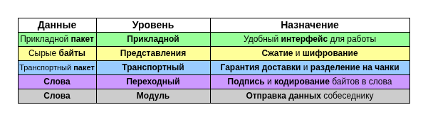
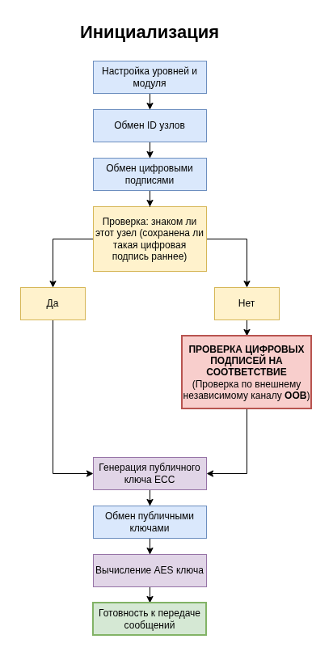
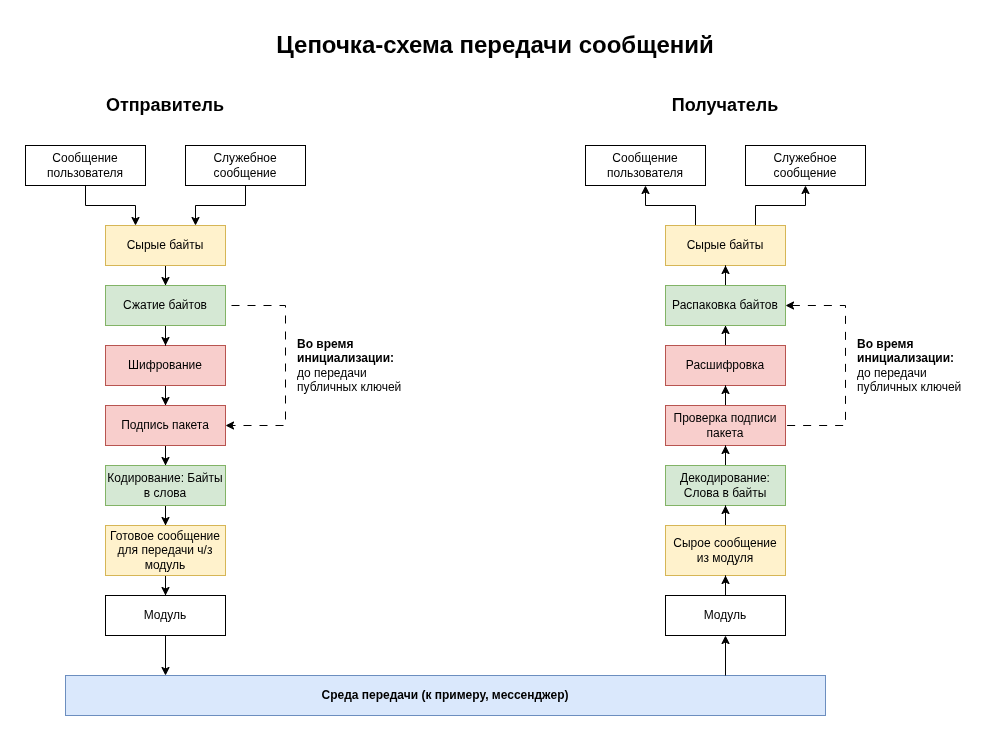
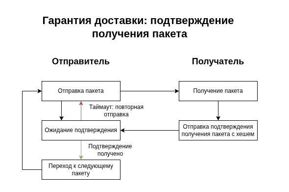
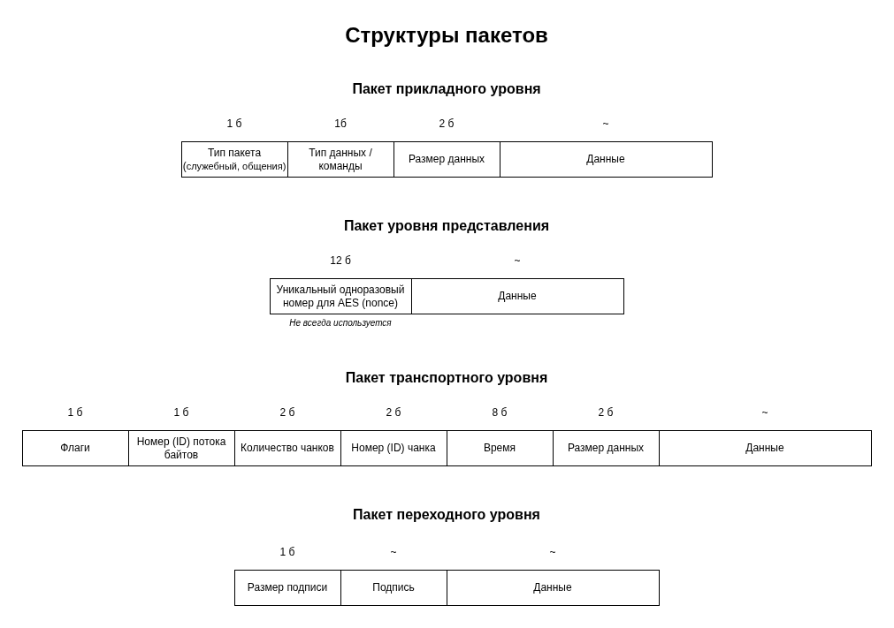

# Документация

## Содержание

- [1. О CryptoLayer](#о-cryptolayer)
    - [1.1. Что это такое](#что-это-такое)
    - [1.2. Зачем это нужно](#зачем-это-нужно)
    - [1.3. Архитектура](#архитектура)
- [2. Использование](#использование)
    - [2.1. Руководство по интеграции](#21-руководство-по-интеграции)
    - [2.2. Основные операции](#22-основные-операции)
- [3. Как работает](#как-работает)
    - [3.1. Кратко по шагам](#кратко-по-шагам)
- [4. Защита данных](#защита-данных)
    - [4.1. Использующиеся технологии](#использующиеся-технологии)
- [5. Модули](#модули)
    - [5.1. Где находятся](#где-находятся)
    
    
    
## 1. О CryptoLayer

### 1.1. Что это такое

CryptoLayer - это библиотека, позволяющая безопасно обмениваться сообщениями через любой мессенджер (и не только мессенджер). 

Библиотека представляет собой независимый слой между пользователем и мессенджером, который обеспечивает защиту передаваемых данных с помощью криптографических средств.

<br>
<div align="center">

</div>
<br>

### 1.2. Зачем это нужно

В современном мире сложно на 100% доверять существующим мессенджерам. Нет гарантии, что ваши данные не будут переданы 3-им лицам или использованы владельцами мессенджера.

Можно сразу подумать о создании своего мега-безопасного мессенджера, но его могут попросту заблокировать или потребовать передачи сообщений пользователей. Именно поэтому CryptoLayer **использует существующие мессенджеры**, а использует он их **просто как линия связи** (провод), к которому нет доверия.

<br>
<div align="center">

</div>
<br>

### 1.3. Архитектура

Библиотека состоит из трёх основных частей: **менеджер**, **псевдосетевые уровни** и **модули**.

<br>
<div align="center">

</div>
<br>

#### Менеджер

Управляет всей логикой, а также псевдосетевыми уровнями. Производит изначальную настройку и инициализацию библиотеки. Отвечает за связь с UI.

#### Псевдосетевые уровни

<br>
<div align="center">

</div>
<br>

Аналог модели TCP/IP. Каждый уровень выполняет строго свою функцию, после чего передает данные на следующий уровень:

- **Прикладной уровень** - предоставляет удобные функции менеджеру, такие как отправка текстового сообщения. Упаковывает всё в прикладной пакет, с необходимыми полями, для удобной работы с данными на этом уровне.
- **Уровень представления** - сжимает данные для более эффективной передачи. Также шифрует данные перед отправкой и расшифровывает после получения.
- **Транспортный уровень** - обеспечивает гарантированную доставку данных путем их разбиения на чанки, упаковкой чанка в транспортный пакет, а затем отправкой пакета с ожиданием подтверждения получения.
- **Переходный уровень** - подписывает отправляемые данные и проверяет подпись полученных данных. Также перед отправкой в модуль кодирурует байты данных в слова, по принципу 1 байт = 1 слово - для маскировки передачи байтов.

#### Модули

Реализуют интерфейс для взаимодействия с каким-либо каналом передачи данных - мессенджером, сервисом или протоколом.

Именно здесь происходит отправка и прием данных, путем обращения к API определенного мессенджера или другого канала связи.

В качестве канала передачи данных можно использовать всё, что только можно: сетевые протоколы (http, ssh, ftp, tcp, udp), сервисы (облачныые диски, стриминговые платформы), мессенджеры, файловые системы - **что угодно! Главное написать модуль.**

Модульность позволяет использовать CryptoLayer в любых мессенджерах, протоколах и сервисах. Главное чтобы существовал модуль для определенного канала передачи данных. Если же его не существует, то его всегда можно разработать.

## 2. Использование

### 2.1. Руководство по интеграции

#### 1. Добавляем CryptoLayer в проект:

Добавляем библиотеку в проект как сабмодуль Git:

```bash
git submodule add https://github.com/igmunv/cryptolayer cryptolayer

git add .gitmodules cryptolayer/

git commit -m "Add new submodule: cryptolayer"
```

ИЛИ, если не хочется возиться с Git, скачиваем последнюю версию библиотеки: 

https://github.com/igmunv/cryptolayer/releases/latest

и затем распаковываем в директории проекта.

#### 2. Добавляем модули CryptoLayer в проект

Проделываем практически тоже самое что и в прошлом пункте. Добавляем репозиторий модулей CryptoLayer в проект как сабмодуль Git:

```bash
git submodule add https://github.com/igmunv/cryptolayer-modules modules

git add .gitmodules modules/

git commit -m "Add new submodule: cryptolayer-modules"
```

ИЛИ, если не хочется возиться с Git, то скачиваем репозиторий.

Если вы будете использовать другой сборник модулей, то просто замените URL.


#### 3. Добавляем библиотеку в конфигурационные файлы проекта:

В конец файла `requirements.txt` или если используется `pyproject.toml`, то в список поля `dependencies` добавляем следующие зависимости:

```
-e ./cryptolayer
cryptolayer-module-interface @ git+https://github.com/igmunv/cryptolayer-module-interface.git
```

Здесь мы добавили CryptoLayer как библиотеку Python, а также `cryptolayer-module-interface` для работы с модулями.

#### 4. Импортируем библиотеки в коде:

Добавленные в прошлом пункте библиотеки импортируем в коде:

```python
from crypto_layer import CryptoLayer
from UIProvider import UIProvider
from base_module import BaseModule
```

Также стоит сразу импортировать модули (это нормально что файла hidden_imports.py пока не существует):

```python
import modules.hidden_imports
```

#### 5. Реализация UIProvider:

Перед созданием экземпляра класса `CryptoLayer`, необходимо реализовать класс `UIProvider`, который является посредником между CryptoLayer и вашим приложением с UI.

Класс `UIProvider` находится в файле `UIProvider.py` в директории CryptoLayer.

#### 6. Модуль:

Перед созданием экземпляра класса `CryptoLayer`, необходимо выбрать модуль, который затем передается в аргументы при создании класса `CryptoLayer`.

Необходимо реализовать выбор модуля пользователем, или статически использовать один определенный модуль.

Поиск всех модулей может выполняться следующим образом:

```python
# Путь к директории сабмодуля с модулями
MODULES_DIR_PATH = "modules" 

# Пробегаемся по всем эллементам в директории
for item in os.listdir(modules_path):

    # Получаем полный корректный путь эллемента
    item_path = os.path.join(MODULES_DIR_PATH, item)

    # Проверяем, чтобы это была директория (ведь модуль находится в директории)
    # И чтобы путь не начинался с '_' (это нужно для исключения определенных директорий)
    if os.path.isdir(item_path) and not item.startswith('_'):

        try:

            # Пытаемся импортировать модуль
            module = importlib.import_module(f"{item}.main")

            # Пробегаемся по всем объектам в импортированном модуле
            for name, obj in inspect.getmembers(module, inspect.isclass):

                # Ищем объект наследованный от BaseModule, но исключая сам BaseModule
                if issubclass(obj, BaseModule) and obj is not BaseModule:

                    # Получаем класс модуля
                    module_class = obj()

                    # Можем добавить модуль в общий список модулей
                    MODULES.append(module_class)
```

После этого модули находящиеся в переменной `MODULES` можно использовать, к примеру, для выбора пользователем определенного модуля. 

У каждого модуля есть поля `name` и `description`, которые можно выводить списком, чтобы пользователь выбрал конкретный модуль. Также у модулей есть поле `unique_id`, которое является уникальным идентификатором модуля, данное поле можно использовать, к примеру, для сохранения какой-либо информации о конкретном модуле в файл.

#### 7. Словарь байт-слово для WordCoder:

Необходимо подготовить словарь для кодирования байтов в слова. Лучше дать пользователю возможность выбирать словари и создавать свои, ведь разные пользователи могут использовать разные программы для работы с CryptoLayer, и у этих программ могут быть свои кастомные словари.

Готовые словари есть в этом репозитории (можно тоже добавить в проект как сабмодуль и затем выбирать необходимый):

https://github.com/igmunv/cryptolayer-wordcoder-dicts

#### 8. Создание экземпляра класса CryptoLayer:

Перед созданием необходимо подготовить следующие переменные:

- `ui_provider` - реализованный класс UIProvider. Нужен для связи приложения с CryptoLayer.
- `data_dir` - путь к директории для хранения данных. Необходим для того, чтобы CryptoLayer мог сохранять там свои данные.
- `module_class` - класс модуля. CryptoLayer будет использовать его в качестве модуля.
- `password` - пароль. Используется, когда CryptoLayer сохраняет данные в файл, для шифрования содержимого (если вдруг пользователь забыл пароль, необходимо удалить директорию по пути `data_dir`)
- `wordcoder_dict` - словарь байт-слово. Необходим для компонента WordCoder, чтобы кодировать байты в слова для маскировки.

Когда все переменные готовы, можно создавать объект класса CryptoLayer:

```python
clayer = CryptoLayer(ui_provider, data_dir, module_class, password, wordcoder_dict)
```

После создания необходимо запустить инициализацию CryptoLayer:

```python
clayer.init()
```

И ждать когда CryptoLayer будет готов. При готовности будет вызвана функция `on_ready` у класса `UIProvider`.

#### 9. Запуск проекта:

Запускать необходимо в следующем порядке (для удобства лучше собрать все команды в один файл, к примеру `run.sh`):

- Обновление сабмодулей:

```bash
git submodule update --init --recursive
```

- Запуск скрипта для генерации файла с зависимостями для модулей:

```bash
python3 modules/generate_reqs.py
```

- Запуск скрипта для генерации файла импорта зависимостей модулей (особенно необходим при сборке проекта в бинарный файл с помощью PyInstaller):

```bash
python3 modules/generate_hidden_imports.py
```

- Установка зависимостей модулей:

```bash
pip install -r modules/common_requirements.txt
```

- Установка зависимостей проекта:

```bash
pip install -r requirements.txt
```

или, если используется `pyproject.toml`:

```bash
pip install .
```

- Запуск проекта:

```bash
python3 main.py # или ваша точка входа
```

### 2.2. Основные операции

#### Отправка сообщения:

Для отправки сообщения необходимо вызвать метод `send` и передать строку в аргументы:

```python
clayer.send(user_message)
```

#### Получение сообщения:

При получении сообщения, CryptoLayer вызовет функцию `on_text_received` у вашего UIProvider и передаст время отправки сообщения, в формате Unix Time Stamp, а также само текстовое сообщение:

```python
class UIProvider:
...
def on_text_received(self, timestamp: int, text: str):
...
```

#### Завершение сеанса/Выход из программы:

Перед завершением сеанса общения с текущим собеседником или перед выходом из программы, необходимо остановить работу текущего экземлпяра класса CryptoLayer с помощью функции `stop`:

```python
clayer.stop()
```

Функция отправит собеседнику пакет `DISCONNECT`, означающий, что мы выходим и заканчиваем общение, а также остановит все потоки и псевдосетевые уровни.

Если же вы не хотите, чтобы отправлялся пакет `DISCONNECT`, то передайте `False` в аргумент `send_disconnect` (это может понадобиться, если собеседник недоступен, то есть был вызван `on_ping_timeout`)

```python
clayer.stop(send_disconnect=False)
```

#### Собеседник недоступен (Таймаут при Ping):

Если вдруг, CryptoLayer обнаружит, что собеседник недоступен, он вызовет функцию `on_ping_timeout` у вашего UIProvider:

```python
class UIProvider:
...
def on_ping_timeout(self):
...
```

### 2.3. UIProvider

Класс `UIProvider` необходим для того, чтобы CryptoLayer мог передавать данные в приложение и его UI. Это, например, текущий статус, новое сообщение от собеседника, сигнал об ошибке и т.д.

При создании приложения на базе CryptoLayer необходимо обязательно реализовать `UIProvider`. 

Разберём каждую функцию в UIProvider, которую необходимо реализовать:

#### `def request_data(self, prompt: str, data_type: type)`:

Функция предназначена для запроса данных от пользователя. В аргументе `prompt`, передаётся текст, который должен выводиться при запросе данных, а в `data_type` тип данных, который функция должна вернуть. Возвращать необходимо данные с тем типом, который указан в `data_type`.

#### `def update_status(self, stage: str, message: str, status_type: str = "in_progress")`:

Функция обновляет текущий статус загрузки и работы CryptoLayer. В `stage` передаётся стадия на которой находится CryptoLayer, в `message` более подробная информация о выполняемой операции, а в `status_type` тип статуса, всего есть три типа статуса: `in_progress`, `success`, `error`. Например, в зависимости от типа, можно выводить статус в разных цветах. Возвращать ничего не требуется.

#### `def on_text_received(self, timestamp: int, text: str)`:

Функция вызывается, когда пришло новое сообщение от собеседника. В `timestamp` время отправки сообщения, в формате Unix Time Stamp, а в `text` само текстовое сообщение. Возвращать ничего не требуется.

#### `def check_signatures(self, my_sign: str, companion_sign: str) -> bool`:

Вызывается для того, чтобы пользователь проверил, что подписи правильные. В `my_sign` передается подпись пользователя, а в `companion_sign` подпись собеседника. Необходимо спросить пользователя, правильная ли подпись собеседника. Необходимо вернуть `True` если верная, `False` если не верная.

#### `def on_ready(self)`:

Вызывается когда CryptoLayer закончил инициализацию, и готов к передаче сообщений. Ничего возвращать не требуется.

#### `def on_ping_timeout(self)`:

Вызывается когда собеседник недоступен. CryptoLayer продолжает работать и дальнейшие действия зависят от приложения. Ничего возвращать не нужно.

#### `def on_disconnect(self)`:

Вызывается когда собеседник отключился и закончил общение. CryptoLayer продолжает работать и дальнейшие действия зависят от приложения. Ничего возвращать не нужно.

## 3. Как работает

### 3.1. Кратко по шагам

- Инициализация
    - Обмен идентификаторами узлов
    - Обмен подписями
    - Обмен публичными ключами
    - Генерация общего ключа
- Основной рабочий процесс     
    - Отправка сообщения пользователя
        - Сообщение проходит через псевдосетевой стек вниз
        - Сообщение отправляется в модуль, а затем в канал связи
    - Получение сообщения собеседника
        - Сообщение приходит из канала связи и отправляется в модуль 
        - Сообщение проходит через псевдосетевой стек вверх
    - Ping
        - Если от собеседника не было сообщений в течении 30 секунд, отправляется PING
        - Если нет ответа на PING в течении 30 секунд, то вызывается функция `on_ping_timeout`
- Завершение работы
    - Отправка пакета DISCONNECT
    - Отключение псевдосетевого стека

### 3.2. Инициализация

<br>
<div align="center">

</div>
<br>

После вызова функции `init` запускается процесс инициализации (необходимо, чтобы оба узла запустили процесс инициализации):

#### Обмен ID узлов

Происходит попытка чтения текущего Node ID из файла `node_id`. Если же файла не существует, идентификатор генерируется и записывается в файл. Затем происходит обмен идентификаторами. Это нужно для следующего этапа.

#### Обмен цифровыми подписями

Дальше начинается работа с цифровыми подписями. Происходит попытка прочитать текущий приватный ключ подписи из файла `sign_private`, если файла не существует или данные не получилось расшифровать, то происходит генерация новой цифровой подписи данного узла.

Затем происходит обмен подписями. После которого проверяется, знакома ли полученная подпись собеседника:

В директории `known_nodes` происходит поиск файла, название которого равно `node_id` собеседника. Если файл существует, данные корректно расшифровались и подпись знакома, то переходим к обмену ключами шифрования, если же файла нет, данные из файла не получилось расшифровать или подпись в файле не равна текущей подписи собеседника, то значит, что мы не сталкивались с этой подписью, и ее необходимо проверить, чтобы удостовериться, что мы точно общаемся с нашим собеседником. 

Пользователю должна быть показана его подпись, и подпись того, с кем он пытается начать общение. Затем оба собеседника должны провести проверку своих ключей по иному каналу связи (личная встреча, по телефонному звонку, в каком-либо мессенджере). Если ключи совпадают, то значит что это точно тот, с кем мы хотим начать общение. После успешной проверки подпись будет записана в файл и CryptoLayer её запомнит. Это означает, что больше не нужно будет проводить проверку, только если собеседник не поменяет подпись или Node ID.

**Этот этап самый важный!** Особенно проверка подписей - её нельзя игнорировать и пропускать! Нужно подходить к проверке корректности подписей максимально серьёзно!

После успешного обмена подписями активируется обязательная проверка подписей у всех пришедших пакетов. Пакеты с недействительной подписью будут отбрасываться и игнорироваться. Теперь можно быть уверенным, что пакеты отправляет именно ваш собеседник, тот с кем вы хотите общаться. **Цифровая подпись решает проблему MITM** и теперь можно смело передавать публичные ключи!

#### Обмен ключами шифрования

На обеих узлах происходит генерация публичного ключа ECC. Затем узлы обмениваются ключами (не забываем, что теперь все пакеты подписываются, и MITM провернуть не получится) и вычисляют общий секрет, который используется для шифрования данных с помощью AES.

Инициализация прошла успешно! Теперь собеседники могут обмениваться сообщениями **МАКСИМАЛЬНО безопасно!**

### 3.3. Основной рабочий процесс

При отправке, сообщение проходит через этот конвейер. Расписывать его не вижу смысла, на изображении всё максимально понятно и ясно:

<br>
<div align="center">

</div>
<br>

Также в процессе работы, CryptoLayer проверяет доступность собеседника: если в течении 30 секунд от собеседника не приходили пакеты, то отправляется пакет Ping на транспортном уровне. Если через 30 секунд собеседник не ответил, то вызывается функция `on_ping_timeout`, после которой CryptoLayer продолжает работать, и дальнейшие действия ложаться на плечи приложения, которое использует CryptoLayer.

### 3.4. Завершение работы

При завершении работы с текущим экземпляром класса CryptoLayer, вызывают функцию `stop`. После вызова собеседнику отправляется пакет `DISCONNECT`, говорящий о том, что мы отключаемся и заканчиваем разговор (текущий сеанс). Затем CryptoLayer ожидает, когда будут отправлены ВСЕ сообщения из очереди, и после этого отключаются все псевдосетевые уровни.

### 3.5. Гарантия доставки

В CryptoLayer есть механизм гарантии доставки пакета (аналог TCP). Этот механизм реализуется на транспортном уровне псевдосетевого стека.

<br>
<div align="center">

</div>
<br>

После отправки пакета, отправитель не отправляет ничего, пока не дождется подтверждения о получении отправленного пакета. Получатель после получения пакета, вычисляет его хеш, и отправляет специальный пакет подтверждения, к которому прикладывает хеш полученнного пакета. Отправитель получает данный пакет подтверждения, проверяет хеш, и если все верно, то переходит к отправке следующего пакета. Если же хеш не верный, то пакет отправляется заново. Или если по истечении 30 секунд, получатель не отправил пакет с подтверждением, то отправитель снова отправляет пакет и цикл ожидания возобновляется.

### 3.6. Стабильность соединения

#### Ping

Если от собеседника не приходили пакеты в течении 30 секунд, то отправляется пакет PING (транспортного уровня), для проверки доступности собеседника. Собеседник получает пакет PING и отвечает на него. Если же от собеседника нет ответа в течении 30 секунд после отправки PING, то вызывается функция `on_ping_timeout`, но CryptoLayer продолжает работать дальше.

#### DISCONNECT

При выходе из программы или при завершении текущего сеанса общения, вызывается функция `stop`, во время выполнения которой собеседнику отправляется пакет DISCONNECT, означающий завершение текущего сеанса общения. После получения такого пакета, CryptoLayer собеседника вызовет функцию `on_disconnect` у UIProvider. В реализации этой функции необходимо завершить работу с текущим экземлпяром CryptoLayer.

### 3.7. Пакеты

В CryptoLayer реализован свой псевдосетевой стек. И у каждого псевдосетевого уровня существуюет свой пакет, со своей определенной структурой:

<br>
<div align="center">

</div>
<br>


## 4. Защита данных

### 4.1. Шифрование отправляемых данных

Для шифрования отправляемых данных на псевдосетевом уровне представления используется алгоритм **AES-256-GCM**

### 4.2. Шифрование файлов CryptoLayer

CryptoLayer сохраняет данные в файл (подписи, знакомых собеседников). И для того, чтобы обезопасить эти данные, используется шифрование, а именно тот же алгоритм **AES-256-GCM**, использующий пароль, который передается в аргументы при создании экземпляра класса CryptoLayer. 

Шифрование содержимого файлов защищает от локального доступа к эти файлам, к примеру, защищает от скрытой подмены электронных подписей уже знакомых собеседников.

### 4.3. ЭЦП и целостность данных

Для цифровой подписи пакетов, используется ECDSA (кривая SECP256R1).

**Цифровая подпись решает проблему MITM!**

### 4.4. Обмен ключами

Для обмена публичными ключами используется протокол ECDH (кривая SECP256R1). Публичные ключи передаются в сжатом формате точек X9.62 (для максимально эффективной передачи по каналу связи).

### 4.5. Маскировка

Для маскировки передачи байтов по каналу связи (мессенджеру в первую очередь) используется замена каждого байта на определенное слово: перед передачей данных в модуль, каждый байт заменяется словом из словаря, в результате из набора байтов `0x12 0x2 0x3f 0x4` получается текст `прямо лес пружина бег`. Этим занимается компонент WordCoder.


## 5. Модули

### 5.1. Где находятся существующие модули

Официальный сборник готовых модулей для CryptoLayer находится [в этом репозитории](https://github.com/igmunv/cryptolayer-modules).

Сборник необходим для использования оттуда модулей в приложениях, которые будут использовать CryptoLayer.

Ваш модуль тоже может попасть туда, просто отправьте Pull Requests и мы с радостью примем его.

### 5.2. Создание собственного модуля

#### 1. Подготовка

В отдельной директории создаём файлы `main.py` и `requirements.txt`.

В `requirements.txt` необходимо указать все зависимости которые использует модуль.

#### 2. Импорт base_module

В `main.py` необходимо импортировать библиотеку с базовым классом для модулей:

```python
from base_module import BaseModule, Credential
```

Библиотека `base_module` находится [в этом репозитории](https://github.com/igmunv/cryptolayer-module-interface).

Не переживайте за то, что этой библиотеки нет в директории с вашим модулем. При использовании CryptoLayer, разработчики приложений добавят необходимые импорты зависимостей и всё будет работать корректно.

#### 3. Создание наследника BaseModule

Теперь необходимо создать класс, который будет наследоваться от `BaseModule`:

```python
...
class Example(BaseModule):
...
```

#### 4. Обязательные поля BaseModule

После, нужно реализовать обязательные поля: `name` (имя модуля), `description` (описание модуля), `unique_id` (уникальный идентификатор модуля):

```python
class Example(BaseModule):
...
@property
def unique_id(self): return "ex.ample_1234"

@property
def name(self): return "Example"

@property
def description(self): return "Description for example"
...
```

#### 5. Данные для входа/авторизации (Credentials)

Далее нужно указать данные для входа/авторизации (Credentials), это может понадобиться, например, если вы пишете модуль для мессенджера или иного сервиса, где без авторизации не обойтись. Также это поле можно использовать для ввода других данных, не только данных для входа: порт, IP-адрес, какие-либо ключи и тому подобное - ограничений нет.

Данные для входа будут запрашиваться в приложении, использующее CryptoLayer.

Для указания данных для входа используется поле `expected_credentials` - это массив, который должен содержать экземпляры класса `Credential`. Первый аргумент конструктора - название, второй - описание этих данных. В качестве примера будем просить пользователя вводить логин и пароль:

```python
class Example(BaseModule):
...
expected_credentials = [Credential("Login", "User name, phone or email"), Credential("Password", "Password")]
...
```

Если данные для входа не требуются, то просто игнорируйте поле `expected_credentials`.

#### 6. Вложенный класс Sender

Далее необходимо реализовать вложенный класс Sender, который отвечает за отправку сообщений в канал связи собеседнику, а именно функцию send, которую вызывает переходный псевдосетевой уровень CryptoLayer. Аргументы функции менять не нужно, просто реализуйте отправку аргумента `text` в ваш канал связи.

В аргументе `user_id` функции `__init__` передается идентификатор пользователя в канале связи. Если идентификатор не требуется, то не используйте это поле.

В аргументе `credentials` функции `__init__` передаются данные для авторизации. Они расположены в том же порядке, как в переменной `expected_credentials`, но уже в формате строк (list[str]).

#### 7. Вложенный класс Listener

Также нужно реализовать второй вложенный класс Listener, который отвечает за получение сообщений из канала связи от собеседника, а именно функцию listen, которая должна получать данные пришедшие от собеседника, а затем обязательно вызывать функцию находящуюся в поле `ingester`, для того чтобы передать данные вверх в переходный  псевдосетевой уровень CryptoLayer

```python
class Example(BaseModule):
...
    class Listener:
        ...
        def listen(self) -> str:
            ...
            self.ingester(received_data) # Обязательно, для передачи данных выше
            ...
...
```

В аргументе `user_id` функции `__init__` передается идентификатор пользователя в канале связи. Если идентификатор не требуется, то не используйте это поле.

В аргументе `credentials` функции `__init__` передаются данные для авторизации. Они расположены в том же порядке, как в переменной `expected_credentials`, но уже в формате строк (list[str]).

#### 8. Функция create_session

Функция `create_session` вызывается при инициализации CryptoLayer (вызов функции `init`). Она предназначена для создании сессии. В функции создаются экземпляры Sender и Listener, происходит инициализация зависимостей для работы с использующимся каналом связи (например создание сессии в мессенджере).

Функция `create_session` принимает один аргумент: `ingester` - в аргументе передается функция, которую затем обязательно нужно передать в Listener при создании экземпляра.

Вы можете переопределить `__init__` у Sender и Listener, если будете передавать туда другие переменные. Главное передавать `ingester` в Listener, так как без него, данные передаваться в CryptoLayer не будут.


### 5.3. Тестирование собственного модуля

Для того, чтобы протестировать ваш модуль, вы можете использовать [CryptoLayer CLI](https://github.com/igmunv/cryptolayer-cli).

Скачайте содержимое репозитория [CryptoLayer CLI](https://github.com/igmunv/cryptolayer-cli).

Далее один раз запустите программу с помощью `./run.sh` или по инструкции в [README.md](https://github.com/igmunv/cryptolayer-cli/blob/main/README.md). 

После этого выйдете из программы.

Скопируйте директорию своего модуля в `src/modules/`.

Далее запустите CryptoLayer CLI, **НО не через `./run.sh`, а следующим образом**:

```bash
python3 -m venv venv
source venv/bin/activate
python3 src/modules/generate_reqs.py # Генерируем список зависимостей модулей, с учетом вашего нового модуля
pip install -r src/modules/common_requirements.txt # Устанавливаем зависимости модулей
python3 src/cryptolayer_cli.py
```

В CryptoLayer CLI появится ваш модуль, теперь вы можете тестировать его.

Если потребуется изменить код модуля, то можете делать это прямо в `src/modules/`. 

**Главное не запускайте `./run.sh` и команду `git submodule update --init --recursive` после копирования модуля в `src/modules/`, так как это удалит ваш модуль!**

После успешного тестирования, можете отправить модуль [в официальный репозиторий, где собраны модули CryptoLayer](https://github.com/igmunv/cryptolayer-modules)!
